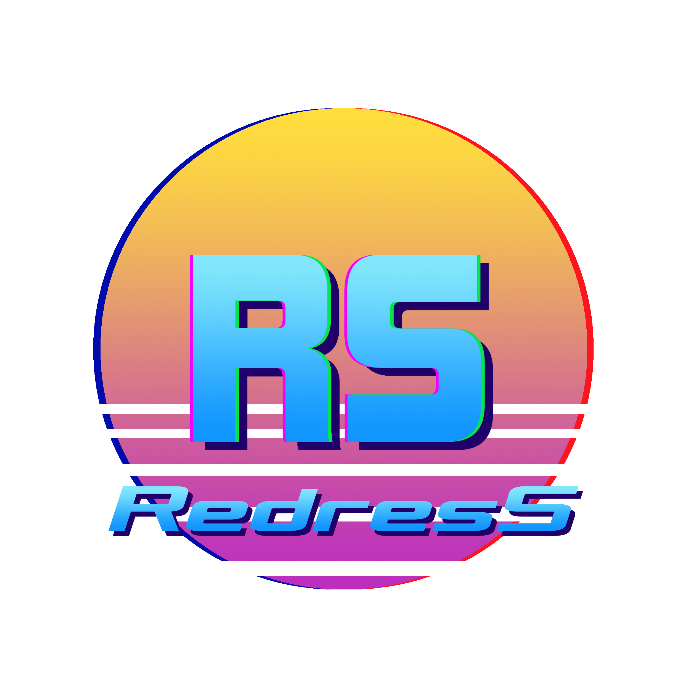

# Redress

In Redress you take control of Joe,  a crossbow olympic champion who has been abducted from the past by a futuristic resistance organization to kill the aliens that have taken over the world. Evade, jump and shoot as fast as you can, it won’t be easy. It's your job to kill as many aliens as you can to become humanity's salvation!

This is a game being developed by students from <a href="https://www.imagecampus.edu.ar/">Image Campus</a>

   

## Credits

- **Guillermina Manzano** - *Programming*
- **Julian Aguirre** - *Programming*
- **Juan Brond Spinelli** - *Art*
- **Nicole Casaux** - *Art*
- **Nicolás Navarrete** - *Audio*
- **Federico Mariano Franco** - *Audio*
- **Estrella D' Alessandro** - *Testing*
- **Ian Leguizamon** - *Testing*
- **Jose Cassini** - *Testing*
- **Julian Acotto** - *Testing*
- **Juan Pablo Kavulakian** - *Testing*

This game was also possible thanks to the support of these professors:

- **Sergio Baretto**
- **Federico Barra**
- **Ramiro Cabrera**
- **Lucía Inés Patetta**
- **Nazareno Rivero**
- **Eugenio Taboada**

## Acknowledgements

- **Adrian Sgro** - Our good friend that always had a helping hand for us

## Links

Download it from itch.io: https://manzanog.itch.io/redress